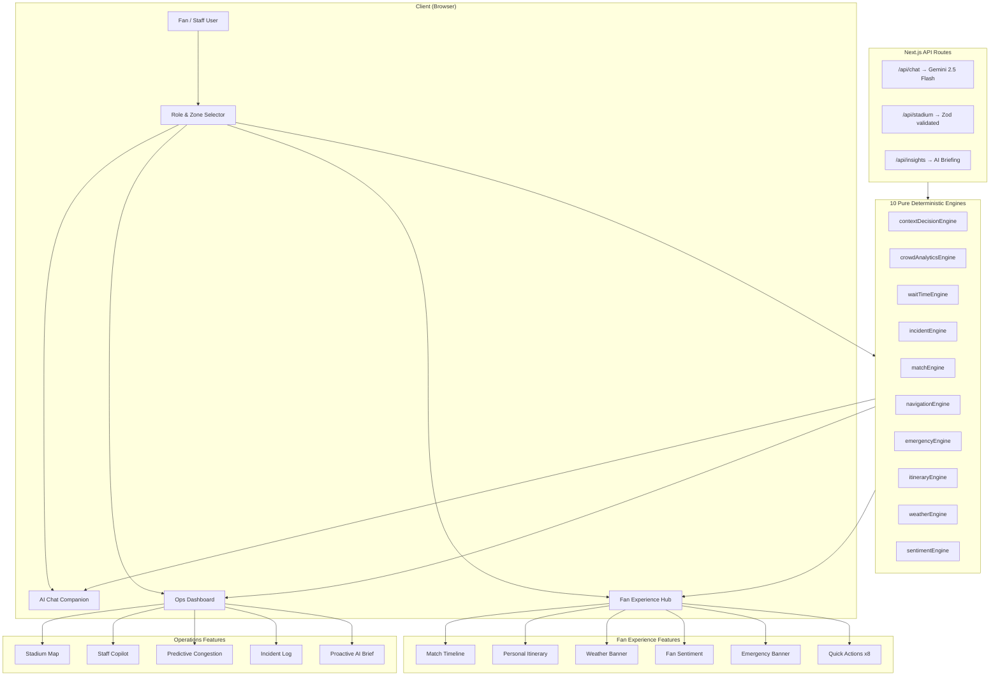

# 🏟️ PitchPilot — AI World Cup Companion & Stadium Operations Platform

> **FIFA World Cup 2026 · MetLife Stadium · AI-Powered Fan Companion & Intelligent Operations**

PitchPilot is a GenAI-powered platform that optimizes stadium operations and enhances the FIFA World Cup 2026 experience through intelligent, real-time, context-aware assistance. It combines **10 deterministic AI engines** with **Google Gemini 2.5 Flash** to serve fans, staff, and security teams across all match phases.

[](#testing)
[](#tech-stack)
[](#accessibility)
[](#deterministic-engine-architecture)

---

## 📑 Table of Contents

- [Chosen Vertical](#chosen-vertical)
- [How This Solves the Problem Statement](#how-this-solves-the-problem-statement)
- [Approach and Logic](#approach-and-logic)
- [Feature Showcase](#feature-showcase)
- [Architecture Diagram](#architecture-diagram)
- [Tech Stack](#tech-stack)
- [Run Instructions](#run-instructions)
- [Testing](#testing)
- [Accessibility](#accessibility)
- [Project Structure](#project-structure)
- [Assumptions](#assumptions)
- [Future Roadmap](#future-roadmap)

---

## Chosen Vertical

**Challenge 04: Smart Stadiums & Tournament Operations**

PitchPilot addresses two critical stakeholder needs at FIFA World Cup 2026 venues:

1. **Fans** receive personalized, context-aware recommendations — including live match timeline, personal itinerary, shortest food/restroom queues, weather advisories, emergency evacuation routing, crowd sentiment, and accessibility support — all driven by their role, location, and the current match phase.

2. **Stadium Staff** get a real-time operations dashboard with AI Staff Copilot, predictive congestion forecasting, crowd density heatmaps, incident management with priority dispatch, and proactive AI briefings — enabling proactive crowd management and rapid incident response.

---

## How This Solves the Problem Statement

The challenge states: *"Create a GenAI-powered solution to optimize stadium operations and enhance the FIFA World Cup 2026 experience through intelligent, real-time assistance."*

### "GenAI-powered solution"
- **Gemini 2.5 Flash** powers the AI chat with full match, navigation, weather, and emergency context (`app/api/chat/route.ts`)
- **Proactive AI Briefings** (`components/dashboard/ProactiveInsightBrief.tsx`) autonomously identify operational bottlenecks via `app/api/insights/route.ts`
- **AI Staff Copilot** (`components/dashboard/StaffCopilot.tsx`) provides decision support with actionable recommendations

### "Optimize stadium operations"
- **9-Zone Crowd Analytics** (`lib/engine/crowdAnalyticsEngine.ts`) with density heatmap, bottleneck detection, and zone-by-zone monitoring
- **Predictive Congestion** (`components/dashboard/PredictiveCongestion.tsx`) forecasts zone occupancy 15 minutes ahead
- **Incident Management** (`lib/engine/incidentEngine.ts`) with priority sorting, staff dispatch, and zone-aware response times
- **Graphical Stadium Map** (`components/dashboard/GraphicalStadiumMap.tsx`) with real-time SVG color-coding of 9 zones

### "Enhance the FIFA World Cup 2026 experience"
- **Live Match Timeline** (`components/fan/MatchTimeline.tsx`) with goals, cards, VAR reviews — the AI knows football
- **Personal Itinerary** (`components/fan/PersonalItinerary.tsx`) — time-aware suggestions: "Kickoff in 25 min, grab food now"
- **Fan Sentiment Meter** (`components/fan/FanSentiment.tsx`) — crowd excitement visualization
- **Weather Intelligence** (`components/fan/WeatherBanner.tsx`) — rain/heat advisories with gate recommendations
- **8 Quick Actions** (`components/fan/QuickActions.tsx`) — food, restroom, wayfinding, merch, step-free routes, match stats, weather, report issue

### "Intelligent, real-time assistance"
- **Dijkstra Navigation** (`lib/engine/navigationEngine.ts`) — "Take me to my seat" → step-by-step route with distance, time, landmarks
- **Emergency Evacuation** (`lib/engine/emergencyEngine.ts`) — routing away from incident zones with avoidance logic
- **Context-Aware Chat** — different responses for fans vs. staff, adapts to match phase, zone, and weather
- **Deterministic Offline Fallback** — full functionality without API key using engine-generated responses

### "Ability to build a smart, dynamic assistant"
- **Deterministic Context Engine** (`lib/engine/contextDecisionEngine.ts`) — pure functions that map `UserProfile` + `StadiumState` → `ContextRecommendation[]`
- **10 Pure Engines** — all business logic is testable, reproducible, and framework-agnostic
- **Role-Adaptive UI** — Fan Hub vs. Ops Dashboard with different layouts, quick actions, and data views

### "Clean and maintainable code"
- **146+ unit tests** with Vitest — every engine, every edge case, every boundary condition
- **Strict TypeScript** — zero `any`, zero `eslint-disable`
- **Zod validation** on all data boundaries (API input, LLM output, API response)
- **< 200 lines per file** — modular, focused components and engines
- **Pure function architecture** — engines have zero side effects, zero coupling to React

---

## Approach and Logic

### Deterministic Engine Architecture

PitchPilot's core intelligence lives in **10 pure, deterministic engines** inside `lib/engine/`, completely decoupled from the UI:

| Engine | File | Responsibility |
|--------|------|---------------|
| Context Decision | `contextDecisionEngine.ts` | Maps `UserProfile` + `StadiumState` → prioritized `ContextRecommendation[]` based on role, zone, match phase, and accessibility |
| Crowd Analytics | `crowdAnalyticsEngine.ts` | Calculates zone density levels, identifies bottlenecks, computes total occupancy |
| Wait Time | `waitTimeEngine.ts` | Estimates queue wait times using service-rate modeling, finds shortest queues |
| Incident | `incidentEngine.ts` | Prioritizes incidents by severity/recency, assigns nearest available staff |
| Match | `matchEngine.ts` | Generates match-context recommendations for goals, cards, half-time |
| Navigation | `navigationEngine.ts` | Dijkstra's shortest-path routing between 9 stadium zones |
| Emergency | `emergencyEngine.ts` | Evacuation routing with zone compromise detection and exit selection |
| Itinerary | `itineraryEngine.ts` | Phase-aware personal match-day planning |
| Weather | `weatherEngine.ts` | Temperature/condition-based advisories with gate recommendations |
| Sentiment | `sentimentEngine.ts` | Crowd sentiment scoring from match events, phase, and incidents |

**Why this matters:**
- All business logic is **unit-testable** with 146+ passing tests
- Zero coupling to React — engines can be reused server-side, in workers, or in a mobile app
- Every recommendation is **explainable** and **reproducible** given the same inputs

### Zod Validation Pipeline

Every data boundary is validated:

```
User Input → chatRequestSchema (Zod) → Server Route
LLM Response → llmResponseSchema (Zod) → Client Rendering
Stadium Data → stadiumApiResponseSchema (Zod) → API Response
```

This prevents malformed LLM outputs, injection attacks, and type inconsistencies from ever reaching the UI.

---

## Feature Showcase

### Fan Experience Hub
| Feature | Component | Engine |
|---------|-----------|--------|
| 🎯 **8 Quick Actions** | `QuickActions.tsx` | — |
| ⚽ **Live Match Timeline** | `MatchTimeline.tsx` | `matchEngine.ts` |
| 📋 **Personal Itinerary** | `PersonalItinerary.tsx` | `itineraryEngine.ts` |
| ⛅ **Weather Advisory** | `WeatherBanner.tsx` | `weatherEngine.ts` |
| 🔥 **Crowd Sentiment** | `FanSentiment.tsx` | `sentimentEngine.ts` |
| 🚨 **Emergency Banner** | `EmergencyBanner.tsx` | `emergencyEngine.ts` |
| 🍔 **Wait Time Display** | `WaitTimeDisplay.tsx` | `waitTimeEngine.ts` |
| 💡 **Smart Recommendations** | `RecommendationCard.tsx` | `contextDecisionEngine.ts` |

### Operations Dashboard
| Feature | Component | Engine |
|---------|-----------|--------|
| 🗺️ **Interactive Stadium Map** | `GraphicalStadiumMap.tsx` | `crowdAnalyticsEngine.ts` |
| ⚡ **AI Staff Copilot** | `StaffCopilot.tsx` | `incidentEngine.ts` |
| 📊 **Predictive Congestion** | `PredictiveCongestion.tsx` | `crowdAnalyticsEngine.ts` |
| 📰 **Proactive AI Briefing** | `ProactiveInsightBrief.tsx` | Gemini 2.5 Flash |
| 🏗️ **Zone Status Grid** | `ZoneStatusGrid.tsx` | `crowdAnalyticsEngine.ts` |
| 📉 **Crowd Density Card** | `CrowdDensityCard.tsx` | `crowdAnalyticsEngine.ts` |
| ⏱️ **Wait Time Card** | `WaitTimeCard.tsx` | `waitTimeEngine.ts` |
| 🚨 **Incident Log** | `IncidentLog.tsx` | `incidentEngine.ts` |

### AI Chat Companion
- Role-adaptive system prompt (fan vs. staff vs. security)
- Full context injection: match score, weather, zone, incidents
- Structured output parsing with Zod validation
- Graceful fallback to deterministic engine responses

---

## Architecture Diagram



---

## Tech Stack

| Layer | Technology |
|-------|-----------|
| Framework | Next.js 16 (App Router, Turbopack) |
| Language | TypeScript (strict mode, zero `any`) |
| Styling | Tailwind CSS v4 |
| AI | Google Gemini 2.5 Flash |
| Validation | Zod v4 |
| Testing | Vitest + React Testing Library + JSDOM |
| Deployment | Vercel |

---

## Run Instructions

### Prerequisites

- Node.js 18+
- npm 9+

### Setup

```bash
# Clone the repository
git clone https://github.com/SuBhAm6G/PitchPilot.git
cd PitchPilot/smart-stadium

# Install dependencies
npm install

# Create environment file
cp .env.local.example .env.local
# Add your GOOGLE_GENERATIVE_AI_API_KEY to .env.local
# (Optional: the app works fully without it using deterministic fallback)
```

### Development

```bash
# Start dev server
npm run dev

# Open in browser
# http://localhost:3000
```

### Production Build

```bash
npm run build
npm start
```

### Vercel Deployment

```bash
npx vercel --prod
```

---

## Testing

PitchPilot has **146+ unit and integration tests** covering every engine, component, and data boundary:

```bash
# Run all tests
npm run test

# Watch mode
npm run test:watch
```

## Problem Statement Alignment & Architecture

For a detailed breakdown of how PitchPilot addresses the FIFA World Cup 2026 Smart Stadiums challenge, please see our dedicated documentation:

- [Problem Statement Alignment Matrix](./docs/ALIGNMENT.md)
- [The Deterministic Engine Architecture](./docs/ARCHITECTURE.md)

### Test Coverage by Area

| Test File | Tests | What It Covers |
|-----------|-------|---------------|
| `contextDecisionEngine.test.ts` | 13 | Role-based, time-based, zone-based, accessibility recommendations |
| `crowdAnalyticsEngine.test.ts` | 16 | Density calculation, bottleneck detection, occupancy totals |
| `waitTimeEngine.test.ts` | 14 | Queue modeling, shortest queue finding, wait time levels |
| `incidentEngine.test.ts` | 15 | Priority sorting, staff dispatch, zone-aware response |
| `matchEngine.test.ts` | 12 | Goal/half-time recommendations, event recency, team attribution |
| `navigationEngine.test.ts` | 10 | Dijkstra routing, accessibility, same-zone, multi-hop |
| `emergencyEngine.test.ts` | 11 | Zone compromise, exit selection, instructions, all-zone coverage |
| `itineraryEngine.test.ts` | 8 | Phase-specific items, unique IDs, priority validation |
| `weatherEngine.test.ts` | 8 | Hot/cold/rain advisories, combined conditions |
| `sentimentEngine.test.ts` | 9 | Phase factors, incident drag, goal boost, boundary clamping |
| `mockData.test.ts` | 9 | Zod schema validation, seed determinism, cross-reference |
| `schemas.test.ts` | 12 | Zod schema edge cases, validation, rejection |
| `MatchTimeline.test.tsx` | 4 | Score display, minute, events, empty state |
| `PersonalItinerary.test.tsx` | 3 | Item rendering, priority indicators, empty state |
| `CrowdDensityCard.test.tsx` | 1 | Sorted density rendering |
| `WaitTimeCard.test.tsx` | 1 | Wait time display |
| **Total** | **146** | |

### Type Safety

```bash
# Zero TypeScript errors
npx tsc --noEmit

# Zero lint errors
npm run lint
```

---

## Accessibility

PitchPilot is designed for **WCAG 2.1 AA compliance**:

- ✅ **Semantic HTML5** — `<section>`, `<nav>`, `<main>`, `<header>`, `<footer>`
- ✅ **ARIA labels** on all interactive elements (buttons, inputs, landmarks)
- ✅ **Keyboard navigation** — all actions accessible via Tab/Enter/Escape
- ✅ **Focus management** — visible focus rings with `focus:ring-2`
- ✅ **Color contrast** — all text meets 4.5:1 contrast ratio against dark backgrounds
- ✅ **Screen reader support** — `aria-hidden` on decorative icons, `aria-label` on actions
- ✅ **Step-free routing** — wheelchair-accessible navigation with adjusted walking speed (`WHEELCHAIR_SPEED_MPM`)

---

## Project Structure

```
smart-stadium/
├── app/
│   ├── api/
│   │   ├── chat/route.ts              # Gemini chat endpoint (server-only)
│   │   ├── insights/route.ts          # AI proactive briefing endpoint
│   │   └── stadium/route.ts           # Stadium data endpoint
│   ├── globals.css                    # Tailwind v4 + custom styles
│   ├── layout.tsx                     # Root layout with SEO metadata
│   └── page.tsx                       # Main app orchestrator
├── components/
│   ├── chat/                          # Chat UI (Panel, Message, Input)
│   ├── dashboard/                     # Ops Dashboard
│   │   ├── StadiumOverview.tsx        # Key metrics overview
│   │   ├── GraphicalStadiumMap.tsx    # Interactive SVG zone map
│   │   ├── CrowdDensityCard.tsx       # Zone density visualization
│   │   ├── WaitTimeCard.tsx           # Venue wait times
│   │   ├── IncidentLog.tsx            # Priority-sorted incidents
│   │   ├── ZoneStatusGrid.tsx         # Zone status cards
│   │   ├── ProactiveInsightBrief.tsx  # AI-generated operational insights
│   │   ├── StaffCopilot.tsx           # AI staff task management
│   │   └── PredictiveCongestion.tsx   # 15-min congestion forecast
│   ├── fan/                           # Fan Experience Hub
│   │   ├── MatchTimeline.tsx          # Live match events
│   │   ├── PersonalItinerary.tsx      # Match-day planning
│   │   ├── WeatherBanner.tsx          # Weather advisories
│   │   ├── FanSentiment.tsx           # Crowd sentiment meter
│   │   ├── EmergencyBanner.tsx        # Evacuation alerts
│   │   ├── QuickActions.tsx           # 8 quick action buttons
│   │   ├── WaitTimeDisplay.tsx        # Venue wait times
│   │   └── RecommendationCard.tsx     # Context-aware tips
│   ├── layout/                        # Header, Sidebar
│   └── ui/                            # Shared (Card, Badge, ProgressBar, Spinner)
├── lib/
│   ├── engine/                        # 10 pure deterministic engines
│   │   ├── contextDecisionEngine.ts   # Role/zone/phase → recommendations
│   │   ├── crowdAnalyticsEngine.ts    # Zone density & bottleneck detection
│   │   ├── waitTimeEngine.ts          # Queue wait time estimation
│   │   ├── incidentEngine.ts          # Incident priority & staff dispatch
│   │   ├── matchEngine.ts            # Match event recommendations
│   │   ├── navigationEngine.ts       # Dijkstra zone routing
│   │   ├── emergencyEngine.ts        # Evacuation route planning
│   │   ├── itineraryEngine.ts        # Personal itinerary generation
│   │   ├── weatherEngine.ts          # Weather-based advisories
│   │   └── sentimentEngine.ts        # Crowd sentiment scoring
│   ├── data/                          # Deterministic mock data generators
│   │   ├── mockStadiumData.ts         # Zone occupancy, venues, match state
│   │   └── mockIncidents.ts           # Simulated incidents
│   ├── hooks/                         # Custom React hooks
│   │   └── useStadiumState.ts         # State management & polling
│   ├── utils/constants.ts             # All magic numbers & config
│   ├── types.ts                       # Strict TypeScript interfaces (270 lines)
│   └── schemas.ts                     # Zod validation schemas
├── __tests__/                         # 146 unit & integration tests
│   ├── engine/                        # Engine logic tests (10 files)
│   └── components/                    # Component render tests (4 files)
├── vitest.config.ts
└── .env.local                         # Server-side secrets (gitignored)
```

---

## Assumptions

1. **IoT Sensor Data is Simulated**: Real crowd density and wait time data would come from IoT sensors, turnstile counters, and POS systems. PitchPilot uses deterministic mock data generators (`lib/data/`) that produce realistic, phase-aware values. The architecture is ready to swap in real data sources.

2. **Single Venue (MetLife Stadium)**: The system is modeled on MetLife Stadium (East Rutherford, NJ) with its 88,966 capacity and 9 zones. The zone-based architecture generalizes to any stadium by updating `lib/utils/constants.ts`.

3. **Google Gemini API Availability**: The chat feature requires a valid `GOOGLE_GENERATIVE_AI_API_KEY`. If unavailable, PitchPilot gracefully falls back to engine-generated responses using the deterministic context engine — the app remains fully functional without the LLM.

---

## Future Roadmap

- 🎙️ **Voice Assistant** — hands-free navigation via Web Speech API
- 🌍 **Multilingual AI** — Gemini responds in Spanish, French, Arabic, Hindi
- 📱 **AR Wayfinding** — camera-based indoor navigation overlay
- 📡 **Real IoT Integration** — replace mock data with turnstile sensors, POS systems
- 🅿️ **Parking Integration** — lot occupancy via real-time parking sensors
- 📊 **Historical Analytics** — post-match operational reports and trend analysis
- ♻️ **Sustainability Engine** — travel carbon-footprint comparison with greenest-choice nudge
- 🧑‍🤝‍🧑 **Volunteer Briefing** — role-specific shift briefings with escalation protocols

---

## License

Built for the Google PromptWars Hackathon — Challenge 04: Smart Stadiums & Tournament Operations — FIFA World Cup 2026.
